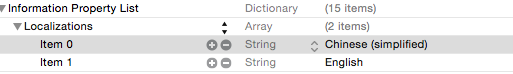

###UIWebView 混合编程
####模板引擎
[**MGTemplateEngine**](https://github.com/mattgemmell/MGTemplateEngine)

[**GRMustache**](git@github.com:groue/GRMustache.git)
####OC与JS互调
[**WebViewJavascriptBridge**](git@github.com:marcuswestin/WebViewJavascriptBridge.git)

###应用内支付
[in-App-Purchase](https://developer.apple.com/library/prerelease/content/qa/qa1329/_index.html)

###开发技巧
####UILable Frame origin不为整数，显示会模糊
####收起键盘
* VC重载touchBegin方法,执行[self.view endEditing:YES],单击任何VC地方都收起键盘
* 直接执行    [[UIApplication sharedApplication] sendAction:@selector(resignFirstResponder) to:nil from:nil forEvent:nil];当获取VC比较困难时用
* [[[UIApplication sharedApplication] keyWindow] endEditing:YES];

####NSJSONSerialization比NSKeyedArchiver好，效率、体积上更优
[测试](https://github.com/randomsequence/NSSerialisationTests)
####系统内控制语言
* UIWebView长按弹出上下文
* UIImagePickerController系统照相机界面
* UITableViewCell编辑状态下删除显示

**他们的语言显示不与手机设置一致，而与应用内语言设置有关**



####巧用截屏
iOS7之后使用`[[UIView new] snapshotViewAfterScreenUpdates:]`,iOS7之前使用

```
+(UIImage *)captureImageFromView:(UIView *)view{
    CGRect screenRect = [view bounds];
    UIGraphicsBeginImageContext(screenRect.size);
    CGContextRef ctx = UIGraphicsGetCurrentContext();
    [view.layer renderInContext:ctx];
    UIImage *image = UIGraphicsGetImageFromCurrentImageContext();
    UIGraphicsEndImageContext();
    return image;
}
```
**用截屏实现侧滑返回效果，带半透明效果，如QQ,WECHAT.push时把截屏传过去给VC，充当其背景内容，当手指右滑时，把VIEW右移，截屏相应右移，并调整透明度，操作完成pop到上一个VC**

####忽略编译警告
编译文件标志写上`-w`或`-Wno-unused-variable`
####XCODE技巧
* `cmd+shift+O`  或  `ctrl + 6`
* Behavious 设置
* 查找功能 `Insert Pattern`
* 清除编译缓存 DerivedData
* 下载XCODE `https://developer.apple.com/downloads/index.action`

####Daily Build
[lexrusg开源](https://github.com/lexrus/ios-makefile)
####删除未使用的图片
brew install ack
####图像处理库
brew install imagemagick


